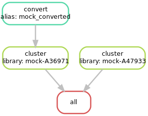
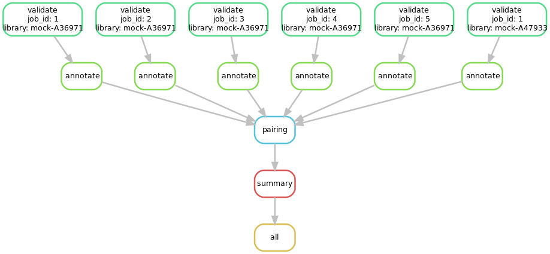
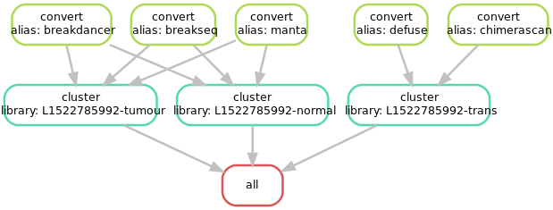

# MAVIS (BIOF510A snakemake)

  [](https://codecov.io/gh/bcgsc/mavis) 

## About

This is an adaptation of [MAVIS](http://mavis.bcgsc.ca) using snakemake. Previously MAVIS
incorporated a lot of custom code for creating local and cluster pipelines. This project tests
using snakemake to accomplish this instead. You can see a comparison of the code changes done to the
project for this project by comparing the develop branch of this repository to its master branch

## Getting Started

First clone this repository

```bash
git clone https://github.com/creisle/mavis_biof501a.git
cd mavis_biof501a
```

### Set up the Python Virtual Env

Install a virtualenv using python3.6 or python3.7 (python NOT anaconda/conda)

Note: python3.8 has shown some issues with pysam install

```bash
python3 -m venv venv
source venv/bin/activate
pip install -U setuptools pip
pip install .
```

The test pipeline which is incorporated here uses mock bam files which are included in the tests
directory of this repository. This is configured by the JSON configuration found at the base
level of this repository

```text
test-mini-tutorial.json
```

### Install the Aligner (Blat)

Before the pipeline is run an aligner must be installed. The default aligner to be used is blat,
although bwa mem can also be configured to be used. Instructions on installing blat can be
found here:

If you are using a linux systems the following should work

```bash
mkdir bin
cd bin
wget http://hgdownload.soe.ucsc.edu/admin/exe/linux.x86_64/blat/blat
chmod 777 blat
```

If you are using a mac, replace the wget step above with the following

```bash
wget http://hgdownload.soe.ucsc.edu/admin/exe/macOSX.x86_64/blat/blat
```

now test that the install worked by running the new executable

```bash
./blat
```

you should see the default help menu

The aligner must be on the default path when the snakemake files are run

```bash
cd ..
export PATH=$(pwd)/bin:$PATH
which blat
```

## Running the Short Tutorial

### Running Snakemake

Due to the fact that the number of files is dynamic, this snakemake pipeline is done in 2 steps.
The first snakemake file will setup the directory, convert input files, and cluster the initial
inputs into a set of jobs. The example below uses a jobs number of 4 but any number 1 or higher
can be used.

This pipeline is flexible to work with any set of samples, the same setup is configured by
the config file that it is passed



```bash
snakemake --jobs 4 -s cluster.snakefile --configfile test-mini-tutorial.json
```

After the first stage is run you should see the following files

```text
output_dir/
|-- converted_outputs
|   |-- mock_converted.tab
|   `-- snakemake.mock_converted.log.txt
|-- mavis.config.json
|-- mock-A36971
|   |-- annotate
|   |-- cluster
|   |   |-- batch-10.tab
|   |   |-- batch-11.tab
|   |   |-- batch-12.tab
|   |   |-- batch-13.tab
|   |   |-- batch-14.tab
|   |   |-- batch-1.tab
|   |   |-- batch-2.tab
|   |   |-- batch-3.tab
|   |   |-- batch-4.tab
|   |   |-- batch-5.tab
|   |   |-- batch-6.tab
|   |   |-- batch-7.tab
|   |   |-- batch-8.tab
|   |   |-- batch-9.tab
|   |   |-- cluster_assignment.tab
|   |   |-- clusters.bed
|   |   |-- filtered_pairs.tab
|   |   `-- MAVIS.COMPLETE
|   |-- SETUP.COMPLETE
|   |-- snakemake.cluster.log.txt
|   `-- validate
|-- mock-A47933
|   |-- annotate
|   |-- cluster
|   |   |-- batch-1.tab
|   |   |-- cluster_assignment.tab
|   |   |-- clusters.bed
|   |   |-- filtered_pairs.tab
|   |   `-- MAVIS.COMPLETE
|   |-- SETUP.COMPLETE
|   |-- snakemake.cluster.log.txt
|   `-- validate
|-- pairing
|-- SETUP.COMPLETE
`-- summary
```

The next pipeline file runs the validate, annotate, pairing, and summary stages of the MAVIS
pipelines.



```bash
snakemake --jobs 4 -s validate.snakefile --configfile test-mini-tutorial.json
```

Once this is complete the file structural variant calls will be in this file

```text
output_dir/summary/mavis_summary_all_mock-A36971_mock-A47933.tab
```

Additionally the annotations folder will contain SVG visualizations of each structural variant
that has been validated and annotated

```bash
output_dir/*/annotate/batch-*/drawings/*svg
```

## Running the Full Tutorial Data set

It is also possible to use this to run a larger more real-data example, however for the purposes
of this assignment we minimize the inputs for running locally. If you would like to try a large example
you can run the data from the
[full mavis tutoral](https://mavis.readthedocs.io/en/latest/tutorials/full).

Note this ~29 GB of data and takes significant resources to run (no less than 6GB ram per  annotation job)

```bash
wget http://www.bcgsc.ca/downloads/mavis/tutorial_data.tar.gz
tar -xvzf tutorial_data.tar.gz
```

Now you can run the same commands as above using the new config `test-full-tutorial.json`. This
will output all the content to directory in the config file: `output_dir_full`.

Unlike the short example, this will annotate the config file with the bam stats which are calculated
during the config validation.

In this second experiment the control is the normal bam included which allows us to validate the
somatic vs germline status of the variants validated.



```bash
snakemake --jobs 2 -s cluster.snakefile --configfile test-full-tutorial.json
```

Note that this is very large job to run outside of a compute cluster so if you run the validate
step for the full config it may take a while. The initial output should give you the following
execution plan

```text
Job counts:
        count   jobs
        1       all
        49      annotate
        1       pairing
        1       summary
        49      validate
        101
```

The memory requirements for each validate job tend to be ~10GB so if running this on low resources
it is recommended to use 1 job maxiumu

```bash
snakemake --jobs 1 -s validate.snakefile --configfile test-full-tutorial.json
```

When complete you should be able to see several canonical cancer fusions in the results

- ALK / EML4
- RET / CCDC6
- FOXO1 / PAX3
- TACC3 / FGFR3
